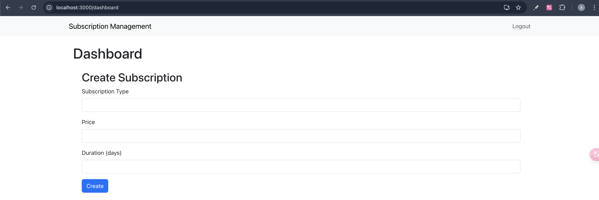

# Blogapp Project

A brief description of your project. Explain its purpose and functionality.

## Table of Contents

- [Features](#features)
- [Backend Setup](#backend-setup)
- [Usage](#usage)
- [Running Tests](#running-tests)
- [Screenshots](#screenshots)


## Features

- The system will allow users to subscribe to various services, manage their subscriptions, and view their subscription details via a web interface.


## Backend Setup

Follow these steps to set up backend locally:

1. **Clone the repository:**

   ```bash
   git clone https://github.com/asadDev29/Subscription-management.git 
2. **Create a virtual environment:**
    python3 -m venv venv
    source venv/bin/activate
3. **Install dependencies**
    pip install -r requirements.txt
4. **Set up the databases**
    python manage.py migrate
5. **Create a superuser (optional, for admin access)**
    python manage.py createsuperuser
5. **CRun the development server**
    python manage.py runserver


## Usage

- Register/Login
- User Subscription Dashboard
- Create Subscription
- update subscription
- delete subscription


## Screenshots

### Register 


### Login 


### Dashboard


### Create Subscription



### Update Subscription


## Running Tests

To ensure your application works correctly, you can run the automated tests included in the project. Follow these steps:

1. **Set Up Your Environment**: Make sure you have the required dependencies installed and your virtual environment activated.

2. **Run All Tests**: 
   To run all tests in your project, execute the following command in your terminal:

   ```bash
    python manage.py test
